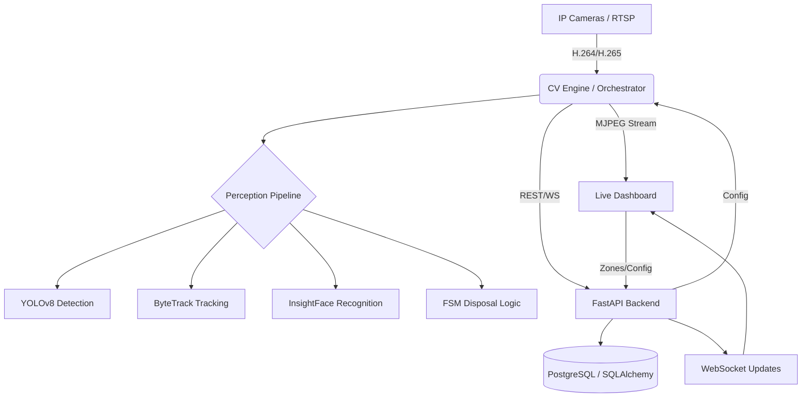

# ECOPE-Production (Environmental Civic Profiling Engine)

[](https://opensource.org/licenses/MIT)
[](https://www.python.org/downloads/)
[](https://fastapi.tiangolo.com/)
[](https://reactjs.org/)

**ECOPE-Production** is an enterprise-grade, GPU-accelerated AI surveillance platform designed for smart city environments. It specializes in real-time detection of waste disposal events, identity tracking using temporal face recognition, and civic profiling based on disposal behavior.

---

## 🚀 Key Features

- **Track-based Vision Backbone**: Uses ByteTrack and YOLOv8 for robust multi-object tracking, ensuring identities are preserved even through occlusions.
- **Temporal Face Recognition**: Integrates InsightFace for high-accuracy identity association across video frames.
- **Disposal FSM (Finite State Machine)**: A logic engine that distinguishes between `PROPER_DISPOSAL` and `LITTERING` by analyzing spatial interactions between tracked persons, waste objects, and defined bin zones.
- **RTSP Ring Buffer**: Low-latency ingestion pipeline with GPU-accelerated decoding.
- **Real-time Dashboard**: A modern React-based interface for live monitoring, event timelines, and system configuration.
- **Automated Event Logging**: Persistent storage of violations with visual evidence and identity metadata.

---

## 🏗 System Architecture



---

## 🛠 Tech Stack

### AI & Computer Vision
- **Object Detection**: YOLOv8 (Ultralytics)
- **Face Recognition**: InsightFace
- **Tracking**: ByteTrack / Supervision
- **Inference**: ONNX Runtime GPU (CUDA/TensorRT)
- **Geometry**: Shapely (Zone/BBox intersection)

### Backend
- **Framework**: FastAPI
- **Database**: PostgreSQL with SQLAlchemy ORM
- **Migrations**: Alembic
- **Real-time**: WebSockets for event broadcasting

### Frontend
- **Library**: React 18
- **Build Tool**: Vite
- **Styling**: Tailwind CSS
- **Communication**: Axios & Native WebSockets

---

## 📂 Directory Structure

```text
ECOPE-Production/
├── backend/            # FastAPI Application
│   └── app/            # Models, API Routers, Schemas, and Utils
├── cv_engine/          # core AI processing pipeline
│   ├── detection/      # YOLOv8 wrappers
│   ├── disposal/       # FSM and Association logic
│   ├── face/           # InsightFace implementation
│   ├── smoothing/      # Kalman filtering for stable tracks
│   └── stream/         # FFmpeg-based video ingestion
├── frontend/           # React + Vite UI
│   └── src/            # Components, Pages, and Assets
├── docker/             # Containerization configs
├── alembic/            # Database version control
├── run_system.py       # Master system launcher
└── zone_config.json    # Local zone persistence
```

---

## 🏁 Getting Started

### Prerequisites
- Python 3.10+
- Node.js & npm
- NVIDIA GPU with CUDA 11.8+ / 12.x support
- FFmpeg installed in system PATH

### 1. Environment Configuration
Copy the template and fill in your credentials and RTSP URLs:
```bash
cp .env.example .env
```

### 2. Installations
```bash
# Backend & AI Engine
pip install -r requirements.txt

# Frontend
cd frontend
npm install
```

### 3. Database Setup
Ensure PostgreSQL is running, then run migrations:
```bash
alembic upgrade head
```

### 4. Running the System
Use the master launcher to start Backend and Frontend:
```bash
python run_system.py
```
Then, start the CV Engine in a separate terminal:
```bash
python cv_engine/orchestrator.py
```

---

## 🧠 Core AI Pipeline: Disposal Logic

The system uses a **Universal Association System** based on a Finite State Machine (FSM). 

1. **State: APPROACHING**: A person enters proximity of a Bin Zone.
2. **State: DISPOSAL_START**: A person's track interacts with a "waste" object track within the zone.
3. **State: VERIFICATION**: Tracked object is released. If it remains inside the zone, it's flagged as `PROPER_DISPOSAL`. If it lands outside, it's flagged as `LITTERING`.

Identities are associated via `FaceSystem` which maintains a vector gallery. If a face is lost, the system uses the `ByteTrack` ID to maintain the association until a re-identification occurs.

---

## 📜 License

This project is licensed under the MIT License - see the [LICENSE](LICENSE) file for details.
