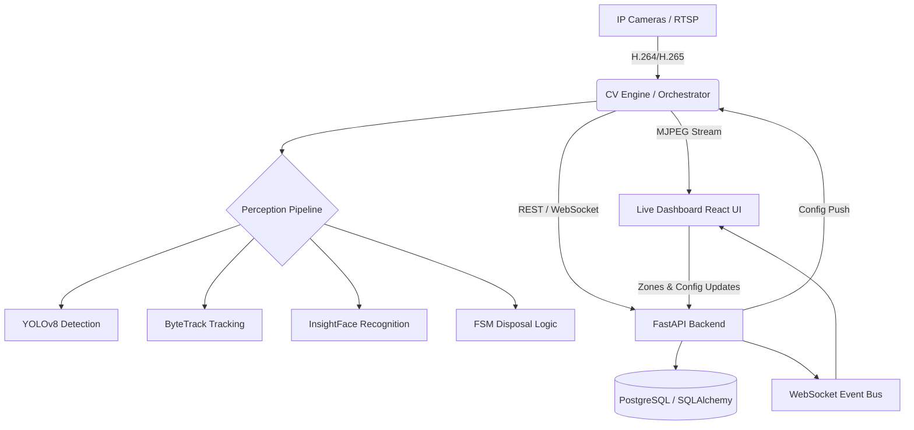

# 🌍 ECOPE-Production (Environmental Civic Optimization Profiling Engine)

[](https://opensource.org/licenses/MIT)
[](https://www.python.org/downloads/)
[](https://fastapi.tiangolo.com/)
[](https://reactjs.org/)
[](https://www.postgresql.org/)

**ECOPE-Production** is an enterprise-grade, GPU-accelerated AI surveillance platform tailored for smart city environments. It specializes in the real-time detection of waste disposal events, continuous identity tracking via temporal face recognition, and automated civic profiling based on disposal behaviors.

---

## 📑 Table of Contents
- [Key Features](#-key-features)
- [System Architecture](#-system-architecture)
- [Tech Stack](#-tech-stack)
- [Directory Structure](#-directory-structure)
- [Getting Started](#-getting-started)
- [Core AI Pipeline](#-core-ai-pipeline-disposal-logic)
- [License](#-license)

---

## 🚀 Key Features

* **Track-based Vision Backbone**: Leverages **ByteTrack** and **YOLOv8** for robust multi-object tracking, ensuring highly accurate identities even through occlusions and crowded frames.
* **Temporal Face Recognition**: Integrates **InsightFace** for persistent, high-accuracy identity association across video frames over time.
* **Disposal FSM (Finite State Machine)**: A custom inference engine that distinguishes between `PROPER_DISPOSAL` and `LITTERING` by analyzing spatial and temporal interactions between tracked individuals, waste objects, and designated bin zones.
* **Low-Latency RTSP Pipeline**: GPU-accelerated video decoding and ingestion buffer tailored for high-framerate IP camera streams.
* **Real-time Monitoring Dashboard**: A modern, responsive **React 18** interface for live MJPEG stream monitoring, spatial event timelines, and dynamic system configuration.
* **Automated Event Logging**: Persistent, verifiable storage of violations using PostgreSQL, saving visual evidence (bounding boxes) and identity metadata.

---

## 🏗 System Architecture

The overarching pipeline decouples the heavy inference workload from the REST API to guarantee low latency broadcasting.



---

## 🛠 Tech Stack

### AI & Computer Vision
* **Object Detection**: YOLOv8 (Ultralytics)
* **Face Recognition**: InsightFace
* **Tracking Workflow**: ByteTrack / Supervision
* **Inference Engine**: ONNX Runtime GPU (CUDA/TensorRT)
* **Geometry Processing**: Shapely (Zone/BBox intersection checks)

### Backend
* **Framework**: FastAPI (Python)
* **Database**: PostgreSQL with SQLAlchemy ORM
* **Migrations**: Alembic
* **Real-time Pipeline**: WebSockets for sub-second event broadcasting

### Frontend
* **Library**: React 18
* **Build Tool**: Vite
* **Styling**: Tailwind CSS
* **Communication**: Axios & Native WebSockets

---

## 📂 Directory Structure

```text
ECOPE-Production/
├── backend/            # FastAPI Application
│   └── app/            # Models, API Routers, Schemas, and Utils
├── cv_engine/          # Core AI processing pipeline
│   ├── detection/      # YOLOv8 wrappers
│   ├── disposal/       # FSM and Association logic
│   ├── face/           # InsightFace implementation
│   ├── smoothing/      # Kalman filtering for stable tracks
│   └── stream/         # FFmpeg-based video ingestion
├── frontend/           # React + Vite UI
│   └── src/            # Components, Pages, and Assets
├── docker/             # Containerization configs (Dockerfiles)
├── alembic/            # Database version control
├── run_system.py       # Master system launcher
└── zone_config.json    # Local zone persistence map
```

---

## 🏁 Getting Started

### Prerequisites
* **Python**: `3.10+`
* **Node.js**: Requires `npm`
* **GPU**: NVIDIA GPU with `CUDA 11.8+ / 12.x` support
* **System**: FFmpeg installed and available in system PATH
* **Database**: PostgreSQL (running locally or remotely)

### 1. Environment Configuration
Copy the template and map in your desired credentials and RTSP URLs:
```bash
cp .env.example .env
```
Ensure you have the valid variables set, particularly `DATABASE_URL` and `RTSP_STREAM_URL`.

### 2. Installations

**Backend & AI Engine**
```bash
pip install -r requirements.txt
```

**Frontend**
```bash
cd frontend
npm install
```

### 3. Database Setup
Once PostgreSQL is running and `.env` is properly configured, execute migrations:
```bash
alembic upgrade head
```

### 4. Running the System
Start the Backend and Frontend with the master launcher:
```bash
python run_system.py
```

Then, initialize the CV inference engine in a separate terminal context:
```bash
python cv_engine/orchestrator.py
```

---

## 🧠 Core AI Pipeline: Disposal Logic

The platform features a **Universal Association System** bound by a Finite State Machine (FSM). The states progress accordingly:

1. **State `APPROACHING`**: A unique individual enters the configured perimeter of a Bin Zone.
2. **State `DISPOSAL_START`**: The system links a person's temporal track with a detached "waste" object track within the active zone.
3. **State `VERIFICATION`**: The tracked object is released. If its terminal bounding box remains *inside* the zone, it triggers `PROPER_DISPOSAL`. If it lands *outside*, it is flagged as `LITTERING`.

Identities are durably associated through the `FaceSystem` array via a persistent vector gallery. If a face goes undetected temporarily, the engine falls back to the `ByteTrack` tracker ID to uphold the connection, guaranteeing robust continuity.

---

## 📜 License

This project is licensed under the MIT License - see the [LICENSE](LICENSE) file for details.
